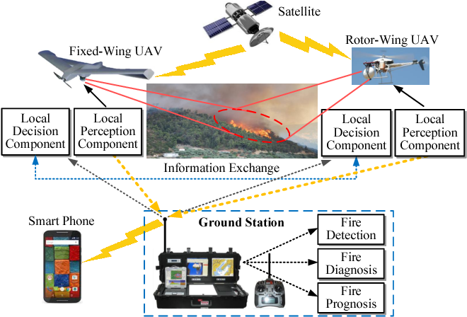

# Yapay Zeka Kullanarak Yangın Tespiti
Bu proje ile tasarladığımız otonom olarak hareket edebilen dronelar ile Yangın Afetlerini önceden tespit etmeyi amaçlıyoruz. Projemiz hâlâ geliştirilme aşamasındadır. 
Proje Fikri <b>Muhammed Furkan Doğan</b> tarafından ortaya atılmıştır.
Proje hakkındaki her türlü görüş, öneri ve teklifleri bu e-mail adresine yapabilirsiniz: mfd_furkan@mail.ru
  

# Proje Özeti	

Orman yangınları yaşanmadan önce alınmayan önlemlerin yangını durdurmada zaman, orman ve can kaybına sebebiyet verebilir.  Projeyi oluştururken ilk olarak aklımıza gelen çevremizde ve ülkemizde artan orman yangınlarının oluşumunun ve etkisinin en aza indirgenmesi  oldu. Bunu da nasıl gerçekleştireceğimizi düşündüğümüzde ise hava yolu ile ve çok maliyet oluşturmayacak olan bir araç aracılığıyla gerçekleştirebileceğimizi düşündük. Takım arkadaşlarımızla bu projeyi oluşturmak için düşünmeye ve öğretmenlerimizden yardım almaya başladık. 

Proje olarak hazırladığımız sistem ile yangın afetlerini daha henüz başlangıç aşamasında tespit edip ilgili yerleri bilgilendirmeyi planlıyoruz.

Bu sistemle yangınları önleyerek akciğerlerimiz olan ağaçlarımızı ve doğamızı korumayı planlıyoruz.

Orman yangınlarının tespiti için günümüzde kullanılan en yaygın çözüm gözetleme kulelerinden ormanların izlemesi veya devriye uçakların orman sahası üzerinde gezmesiyle gerçekleştirilmektedir. Bu yöntemler yangınlara müdahelede saniyelerin bile önemini dikkate aldığımızda yeterli olmadığını görmekteyiz. Bizim Dendron projemizdeki amaç kısa sürede ve uzun vadede etkili olacak bir çözüm olmaktır. Orman yangınları tüm ülkelerin başına gelebilecek afetlerdir ve toplumumuzu ekonomik ve sosyal açıdan etkilemektedir. Yangınların oluşmasına bir çözüm bulamayız ama erken müdahele için en etkili çözümü sunmaktayız. Dendronlarmız yangını tespit eder internet siteleri ve sosyal mesajlaşma platformları üzerinden gerekli mercilere problem konum ile birlikte iletilir. Bu şekilde yangının konumu gerekli yerlere iletilmiş olur.

 

Projemizi uygularken geliştirmiş olduğumuz sistemi özel olarak tasarlayacağımız bir drone üzerine yerleştireceğiz. Bu sistemde kamera modülü ile ateş vb. faktörleri tespit etmeyi, gaz sensörleri ile bölgedeki karbon monoksit vb. gazların yoğunluğunu ölçmeyi, GPS modülü ile ise drone’nin eş zamanlı konumunu aktarmayı planlıyoruz. Bu sistem üzerinde bulunan çeşitli sensörlerle dronun bulunduğu bölgede risk taraması yapacak ve şüpheli bir durum tespiti halinde ilgili yerin konumu, fotoğrafı ve şüphelenilen değerleri sistemimiz üzerinden ilgili yerlere bildirecektir. Sistemimiz tarafından gönderilen sinyallerle dronumuzun kontrollerinin büyük çoğunluğunu otonom olarak gerçekleştireceğiz.

Projemizi hayata geçirebilmek için bir droneyi yaptığımız sistem ile yönetmemiz ve ona sinyal göndererek çeşitli emirler vermemiz gereklidir. Dronenin üzerindeki sistemde bulunan kamera modülü ile yapay zeka kullanarak yangın ve duman görüntüsü taraması yapacağız. Ayrıca dronemizin üzerinde bulunan diğer tespit sensörleri (alev, gz vb.) ile de bu tespitin doğruluğunu saptamaya çalışacağız. Elde edilen bulguları dronenin bulunduğu konum, tespit edilen yerin fotoğrafı, tespit zamanı, ortamda bulunan karbon monoksit vb. gazların yoğunluğu gibi verileri ilgili yerlere bildireceğiz.

Copyright &copy; Muhammed Furkan Doğan 2021-2022 All rights reserved.

